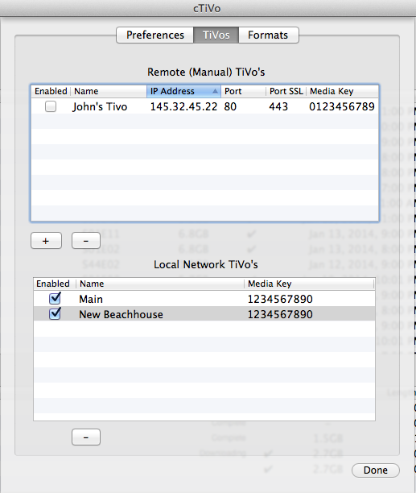
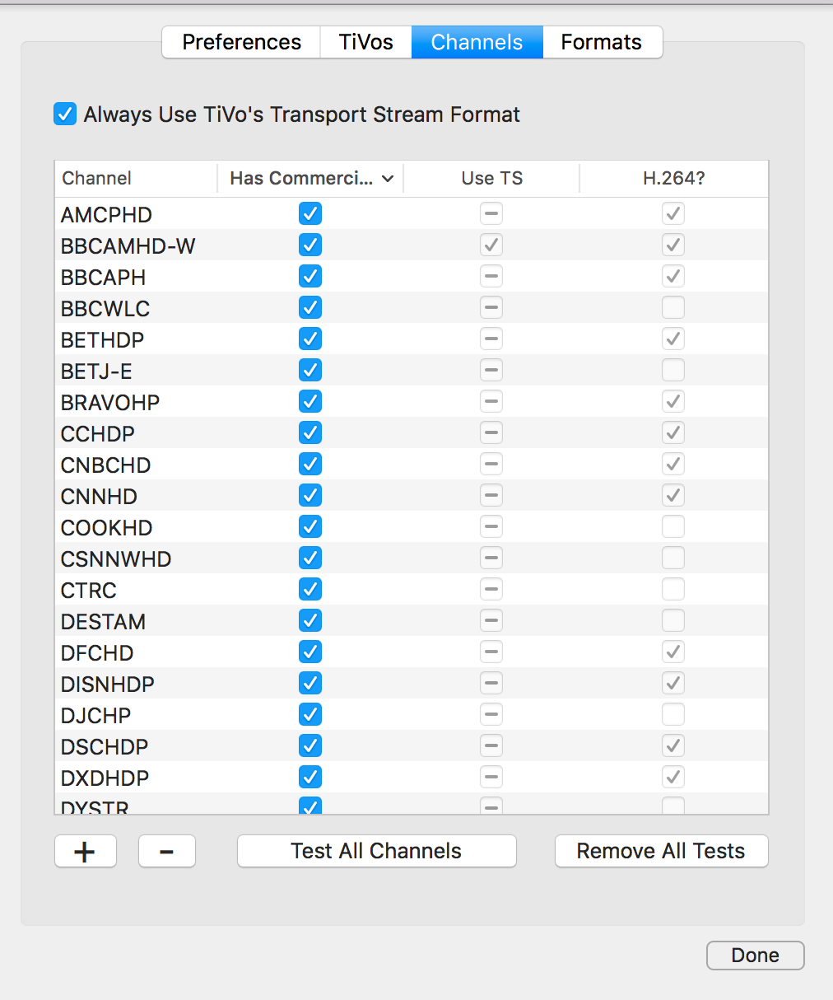
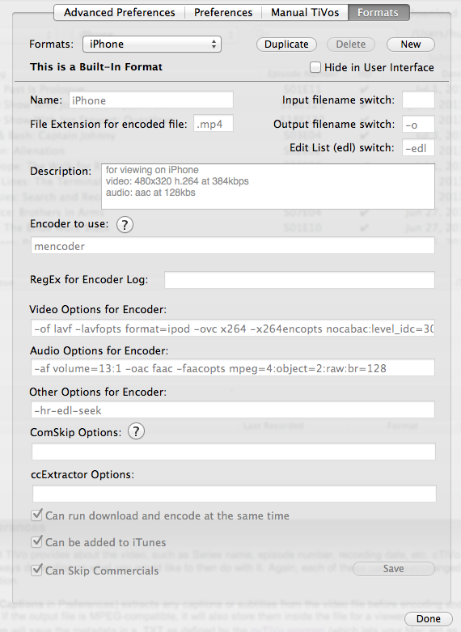
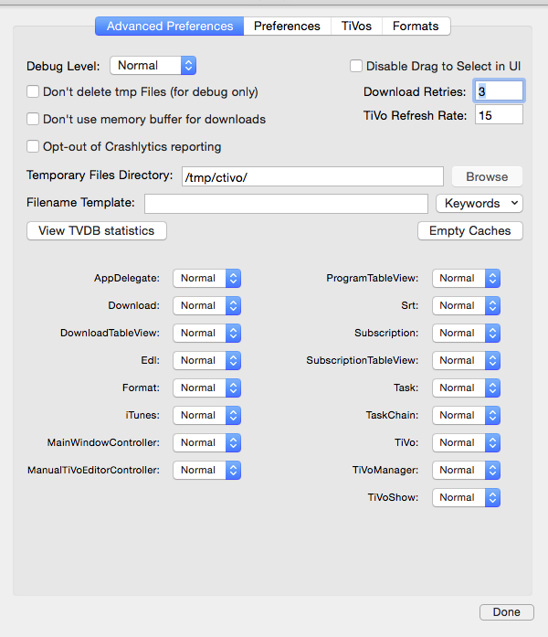

# Advanced Topics
## Configuration options designed for advanced users

This document is to cover some interesting topics, but really for advanced users only  

- [Artwork](#artwork)
- [Manual TiVos](#manual-tivos)
- [Edit Channels](#edit-channels)
- [Edit Formats](#edit-formats)
- [Advanced Settings](#advanced-settings)
- [theTVDB](#thetvdb)
- [Advanced Subscriptions ](#advanced-subscriptions)
- [Filename Templates](#filename-templates)
- [Hidden options](#hidden-options)

# Artwork

For MPEG files (.MPG, .MP4, .MOV, or .M4V), cTiVo can embed a still picture inside the file to represent it in Finder, iTunes, iOS devices, or other players that understand this standard. First (default case), you can choose the same image used by your TiVo to represent the show; this will be a series-wide image downloaded directly  from your TiVo. Secondly, you can choose fan-generated art from theTVDB.com website (although this is dependent on the series/episode/movie being in the database). With this option, you can then choose either episode-specific, season-specific, or series-wide artwork.

Third, you can manually add artwork directly to an episode. With the "Art" column enabled in the Now Playing Table, just drag your preferred artwork on top of any existing (or blank) artwork. This will then be embedded in any downloads of that show. cTiVo will even update any pre-existing downloads with that image. You can similarly remove any artwork (manually added or automatic) by dragging the image to the Trash. If manual, this will delete the matching image file from disk and from any existing downloads.

Finally, you can store artwork in your download folder, but the filename has to be in a very specific syntax. Note that this is the mechanism that the drag/drop ability uses; it simply creates a file in the appropriate location.

The filename must start with the series title (e.g. "The Daily Show with Jon Stewart") with any slashes or colons replaced with dashes. Then you can create a series-generic file (no suffix), a season-specific file (suffix of Snn, or an episode-specific file (suffix of SnnEnn). Movies start with their title and optionally the movie year XXXX as a suffix (e.g. "Fight Club_1999")

These files can be in almost any format supported by the OS, and can be stored in the download directory itself or in a "thumbnails" subdirectory of the download directory. If you have enabled series-specific subdirectories within the download directory, they can also be in that directory, or in a "thumbnails" subdirectory of that subdirectory.  Finally, if you want to specify an image directory, use the secret command  `defaults write ThumbnailsDirectory <path>`  in Terminal. If there is more than one image, it will choose episode-specific, then season-specific, then series-wide in that order.

To increase the chances of finding appropriate artwork, it will use the first one it finds in the following order:
- Local episode-specific (SnnEnn)
- Local season-specific (S00)
- Local series-wide
- Whichever online source (TiVo or TVDB) you specify
- The other online source
- Initial frame from video

For movies, the order is:

- Movie title with matching year suffix
- Movie title without year suffix
- theMovieDB artwork (if enabled and available)
- Initial frame from video

Especiallly if you use these facilities, consider giving back to theTVDB and theMovieDB by entering any missing information into their systems, including appropriate artwork!

# Manual TiVos

Normally, cTiVo discovers TiVos on the local network automatically using a network technology called BonJour. Normally this will work fine, but if you need to enter a TiVo address manually or wish to access your TiVos remotely, you'll need to enter their information with the Edit>Edit Manual TiVos menu item. This will show any TiVos you've previously seen or entered. Use the + button to add a new one, or the - button to delete one. If you'd like to temporarily delete one, just uncheck the "Enabled" button. You can get the TiVo's current local IP address from its Networks and Settings screen, although this may change over time, especially when your TiVo is restarted. For the local network, you should always use the ports provided (80/443/1413)



Interestingly, you may also be able to use cTiVo remotely, although this can take some network ability and patience.  Patience both in the sense of trial and error as well as in the upload bandwidth available on your connection to the Internet. You will need to set your router to pass external accesses to your main IP address through to your TiVo. As you may be doing this for other devices as well, we also let you adjust the ports cTiVo uses to match whatever port mapping you're doing in your router.  If you didn't understand this paragraph so far, then you probably shouldn't be doing this. You'll need to map the three ports (80/443/1413) to make this work. Note that whether this violates your terms of service with your cable company, TiVo Inc, your internet provider, any random film studio in Hollywood, or anybody else is entirely up to you.

# Edit Channels

With the transition to H.264 by many cable companies, TiVo requires the use of Transport Stream to download an H.264 video. While Transport Stream can also be used for MPEG2 videos, this seems to be less reliable. Thus cTiVo tracks which channels seem to require H.264. While this process is automatic, this screen allows you to see what's happening and control it if desired.  These channels will get filled in as you download shows, based on whether or we see the characteristic failure of H.264 over Progressive Stream of no video, just audio in the downloaded file.


First, you can simply turn on Transport Stream for all downloads with the control at the top.

- **Has Commercials** allows you to specify that a given channel has no commercials, so don't bother doing comskip on it (e.g. PBS)
- **Use TS** lets you control whether to use TS or not for a given channel. √ means "use TS". - means "cTiVo chooses" based on whether we have seen H.264 or not, and blank means "don't use TS".
- **H.264** indicates whether we've seen a channel use H.264 or not. 

You can manually remove channels from this list by selecting them and hitting the Minus sign at the bottom, or add one by hitting the Plus sign.  

If you'd like us to check all your channels, then click on Test All Channels. This will add a show from every channel your TiVo has recorded (including Suggestions) with a special TestPS Format. This Format only downloads a short segment from each show to quickly test every channel. You can then remove all such Tests with the final Remove All Tests button. This is not required as each channel will simply retry the first time we see a PS failure, but it can be interesting to see what channels have converted.

# Edit Formats

If you'd like to configure a different video encoder, or provide different parameters to the built-in ones than we have configured, then you can use the Edit>Edit Formats menu item. This gives you a screen where you can configure a new encoder format, or use an existing format as a template. 



- Start by selecting the closest format from the Formats pulldown.
- If it's a built-in format (or you wish to have two versions of your own format), Duplicate it to create a new one that you will modify with your new parameters. You cannot edit a built-in format without duplicating it. You could create one from scratch with New, but it's probably easier to modify an existing one in most cases. Obviously, if you no longer want a user-defined format, you can Delete it here as well.
- There is a special case for Handbrake as they have so many built-in presets and you can define your own as well in their GUI (as of 12/15, you have to use a recent version, called a "nightly"). Just select any built-in Handbrake Format and pull down the preset menu on the right. This will create a new User Format with that preset, which you can then modify as you see fit.
- All formats can either be hidden or visible in the main user interface. So if you don't have any use for many of the built-in formats, just mark them as Hide in User Interface. Similarly we hide many that are not commonly used, just uncheck that box.
- Below the line are all the parameters available for editing. Again, built-in formats cannot be edited without Duplicating, so their parameters will be greyed out.
- **Name of the Format** as displayed in the menu. This must be unique versus all other built-in or user formats.
- **File Extension for Encoded File**. cTiVo will use this to generate the filenames. Some encoders ignore an incorrect extension, and put the correct one in, which will cause problems, so be sure this is correct.
- **Description**. This is just a short human-readable reminder of what the other options mean.
- **Input Filename/Output Filename/Edit List Switch:** these are passed in the command line to the encoder (see [Arguments](#arguments)
- **Encoder to Use**: See [Encoder To Use](#encoder-to-use)
- **Regex for Encoder Log**: If the encoder cannot support simultaneous encoding (e.g. HandBrakeCLI), the encoder should provide in its standard output the percentage complete as a number from 0-100.  You will need to provide a regex expression for extracting this number from the last few lines of the standard output.  For example, HandBrakeCLI writes its progress as 87 %, so the regex is `([\%` This will only be used when doing sequential downloading, decrypting, and encoding.  When doing simultaneous encoding, the data flow through the pipes is used to measure progress.
- **Video/Audio/Other Options for Encoder:** These are passed on the command line to the encoder; see [Arguments](#arguments).
- **Comskip Options**: ComSkip is an experimental feature for cTiVo; See [the comskip project](http://www.kaashoek.com/comskip/). Included in this implementation is a configuration file (comskip.ini), which can be found on the [cTiVo  source code page](../cTiVo/comskip.ini). In addition to other command line parameters, you can replace the built-in comskip.ini with your own comskip.ini file by entering "--ini=\<full path\>/comskip.ini" providing the full path to your own file.
- **ccExtractor Options**: ccExtractor exports subtitles from the video stream into a .srt text file. See  [the ccExtractor project](http://ccextractor.sourceforge.net/using-ccextractor/command-line-usage.html)
- **Can run download and encode at same time** should be set only if the encoder can run as a final stage of a pipeline (stdin being the source pipe).

 - **Can be added to iTunes** means that the file format generated is compatible with iTunes, and will simply enable or disable that option for the user.

 - **Can Skip Commercials** means whether to enable that option for the user. If enabled, the encoder must handle the edl as generated by comSkip.

## Encoder to Use

Enter either the name or the full path to the encoder to be used. The paths searched for the encoder are (in order)
````
    	<cTiVo Bundle>
    	/usr/local/bin
    	/opt/local/bin
    	/usr/local/<encoder name>/bin
    	/opt/local/<encoder name>/bin
    	/usr/bin
    	<Full path>
````
If the encoder accepts - (dash) for standard input, you should check 'Can run download and encode at the same time' to allow simultaneous encoding. The encoder must be marked as executable. mencoder & HandBrakeCLI are included in the cTiVo bundle. 

Your encoder can be a script file (with standard first line of #! to specify script type, such as #/usr/bin/sh for shell script or #!/usr/bin/osascript for Applescript), provided it accepts the above arguments and is marked as executable. Be sure to test script-based encoders with shows having special characters like single or double quotes or Unicode characters in their names.

## Arguments
The command line passed from the options are:
````
    	<Video options>
    	<Audio options>
    	<Other options>
    	<Edit List Switch>   //These two only if running comSkip to skip commercials.
    	<.edl FileName>
    	<outputFileSwitch>
    	<<outputFileName>>
    	<inputFileSwitch>
    	<inputFileName>
````
OR, if no outputFileFlag:
````
   	    <Video options>
    	<Audio options>
    	<Other options>
    	<EDL Switch>		//These two only if running comSkip to skip commercials.
    	<.edl FileName>
    	<inputFileSwitch>
    	<<inputFileName>>
    	<<outputFileName>>
```` 
If you are debugging a format, you can use the advance preferences to increase the debugging level. See [Log Files](#log-files) below for more information. You can also set the "Don't Delete tmp files" option, which will save the subsidiary program log files (from your encoder, comskip, etc) for your perusal. Be sure to set it back when finished debugging as it will generate massive temp files.

# Advanced Settings

There are a few preferences that are intended for debugging purposes or for very advanced users only. These are hidden, but can be activated by holding down the Option key while pulling down the cTiVo menu and selecting Adv Preferences (alternatively Option-Cmd-Comma). 



### Debug Levels

This will increase the level of detail written to the Console log from tracking None to Verbose for all modules. As "verbose" is indeed very verbose, you can also set the debug level separately for each of the major modules in the program at the bottom of this screen. This would mainly be of use while reading the source code or under the direction of someone helping you debug a problem. See (Logging)[Troubleshooting.md#Logging] for more information. Note if you have a problem during startup, you can hold down Control and Option during launch to change all modules to Verbose. As operating in Verbose mode all the time is not recommended, cTiVo will automatically switch from Verbose to Major unless you hold down Control-Option during startup.

### Disable Drag to Select in UI

OS X has an inconsistency of what "click on a filename and then drag across multiple files" means.  This can either mean "drag the first file", or "select multiple files". Our default is the latter, but you can change it with this option.

### Don't Delete tmp Files

During its processing, cTiVo creates several intermediate files, which are deleted upon completion. The video files are typically in the download directory, and the others (sub-program log files, etc) are in the /tmp/cTiVo/ directory. For debugging purposes, this option lets you turn off the automatic deletion. Setting this option can burn up your hard drive space very quickly, so be sure to disable after debugging!

### Download Retries

If cTiVo encounters a failure (network not available, encoder problem, etc), it will retry automatically. This option lets you change the number of times it retries before giving up entirely; default is 3. Note that zero retries means try the main time then give up, so 1 attempt.

### Don't use memory buffer for downloads

For performance reasons, cTiVo will normally download the TiVo file into memory rather than writing it to a temporary file. Sometimes for debugging purposes, it's convenient to have it write these files directly to disk, and this option enables that.

### TiVo Refresh Rate

How often (in minutes) should cTiVo check the Now Playing list of your TiVos. Default is 0, which means 4 hours for TiVos capable of RPC and 15 minutes for older TiVos (Premiere, HD or older).

### Opt-out of Crashlytics reporting

If cTiVo crashes, it will report where in the program that occurred on the next startup, unless this option is checked. In addition, cTiVo anonymously reports success/failure rates for different Formats.

### Decode With:

The .tivo files are encrypted with your Media Access Key (MAK), which is why cTiVo needs that key to download your shows. The old program "tivodecode" doesn't handle Transport Stream at all. Two new programs, `tivodecode-ng` and `TivoLibre`, do handle that as well as the H.264 compression format. So there is now a pull-down in Advance Preferences to choose which decryption to use. There is an alternative, `TiVoLibre`, which may handle more cases, but requires Java runtime to be installed on your Mac, which Apple no longer recommends.  If you don't have Java, TivoLibre will be disabled.

### Temporary Files Directory

While the video files are stored in the download directory, during processing many other files are stored in a working directory. By default this is in /tmp/ctivo, and is emptied as each transaction is finished and when cTiVo starts up. You can change this directory here.

### View TVDB Statistics

Displays the results of theTVDB lookups since cTiVo has started, or since an Empty Cache command. See [theTVDB](#thetvdb) for more on interpreting this information.

### Empty Caches

Empty Caches erases the caches stored in the program and reloads the information contained. The two caches are theTVDB information, the RPC information, and the detailed XML loaded from the TiVo for each show. Be warned that if you have hundreds of shows on your TiVos, this will generate a lot of network traffic. If you think something is wrong with the information being displayed this might be useful, but more important reason for this command is to reset theTVDB statistics to go directly to the source rather than using the cache. See [theTVDB](theTVDB) below for more information.

## TheTVDB

For some reason, TiVo stopped filling in the season/episode information on many shows, but does provide it through the RPC mechanism. Sometimes this information is inaccurate, and if you prefer theTVDB's season/episode information, you can check the box in Preferences.and we will look up an episode to fill in. Fair warning: the following paragraphs on how this all works may be more information that you want!

There are several steps involved here, and as theTVDB is fan-maintained, the process is not always successful. TiVo used to license show information from the Chicago Tribune Media Services company Zap2It. This information is organized by Episode IDs, which look like EPnnnnnnnnmmmm, where the N's are 8 digits representing a series ID, and the 4 M's specify the episode within that series. However with the transition to Rovi data, this EpisodeID has changed and is no longer compatible with theTVDB.

First we have to match the series, which is done by title name, which can lead to multiple matches (and we have to handle season subtitles, such as  24: The Lost Weekend). Then to find an episode, we match on "Original Air Date" as listed in both databases. This works well overall, but there is one major problem. If a show is first shown in one country and then shown again in another (e.g. Doctor Who, or most shows on BBC America), theTVDB considers them the same series and uses an Original Air Date from the first country. On the other hand, TiVo considers them separate series and uses the second country's Original Air Date. With the new TVDB database, we then look for the episode by SxxExx number and then by name, so we get much better coverage.

Finally, if we do find the episode, then we can then use the fan artwork, if any exists for that show. And if TiVo does not happen to have that season/episode info (especially on older TiVos), we can use theTVDB's instead. Note that there are frequent cases of season/episode mismatch, where theTVDB has a different information than TiVo provides, we've chosen to follow TiVo's lead, but you can change then in Adv Preferences.

There are two buttons relevant to this process in the Advance Preferences window. The first is View TVDB stats, which shows you the result of this process summarized since the program began. Note that for performance reasons, we cache the TVDB results, so if you want a true picture of the results for the current list of shows, you will need to use the other button Empty Caches. After a few seconds (or even a minute or two), View TVDB stats will show you how many series were found (and by which method), which episodes were then found, and how many episodes matched, and which ones didn't match.
````
    {
        "Episode Found" = 20;
        "Episode Found in Cache" = 16;
        "Episode Not FoundCount" = 17;
        "Episode Not FoundList" =     {
            "Access Hollywood" = "EP00188707 aired 2013-07-03 http://thetvdb.com/?tab=series&id=70829 ";
            "Antiques Roadshow: Vintage Milwaukee" = "EP00203652 aired 2013-07-01 http://thetvdb.com/?tab=series&id=83774 ";
            "Entertainment Tonight" = "EP00001457 aired 2013-07-04 http://thetvdb.com/?tab=series&id=70640 ";
            "Masterpiece Classic: Mr. Selfridge: Part 1" = "EP01088332 aired 2013-03-31 http://thetvdb.com/?tab=series&id=193131 ";
            "Selling New York: The Push" = "EP01231570 aired 2010-05-27 http://thetvdb.com/?tab=series&id=215131 ";
            "The Doctors: Must-Know Gadgets, Gizmos and Health Trends" = "EP01074571 aired 2012-11-08 http://thetvdb.com/?tab=series&id=242951 ";
            "The Wendy Williams Show: Mistresses" = "EP01061654 aired 2013-06-05 http://thetvdb.com/?tab=series&id=262904 ";
            "Throwdown With Bobby Flay: Fried Chicken" = "EP00841501 aired 2007-01-24 http://thetvdb.com/?tab=series&id=112581 ";
            "Wipeout: Boss & Employee: Third Shift" = "EP01046187 aired 2013-05-30 http://thetvdb.com/?tab=series&id=77253 ";
        };
        "Season/Episode Info Added" = 15;
        "Season/Episode Info Match" = 16;
        "Season/Episode Info MismatchCount" = 5;
        "Season/Episode Info MismatchList" =     {
            "MythBusters: Painting With Explosives; Bifurcated Boat" = "12/9 v our 92/6; EP00557678 aired 2013-06-26; http://thetvdb.com/?tab=series&id=73388 ";
            "Phineas and Ferb: Knot My Problem; Just Desserts" = "4/16 v our 44/3; EP00948847 aired 2013-07-05; http://thetvdb.com/?tab=series&id=81848 ";
            "Raising Hope: The Walk for Runs" = "3/8 v our 3/6; EP01279218 aired 2012-11-27; http://thetvdb.com/?tab=series&id=164021 ";
            "Raising Hope: What Up, Bro?" = "3/6 v our 3/4; EP01279218 aired 2012-11-13; http://thetvdb.com/?tab=series&id=164021 ";
            "The Ellen DeGeneres Show" = "10/169 v our 10/162; EP00599270 aired 2013-05-30; http://thetvdb.com/?tab=series&id=72194 ";
        };
        "Series Found EP" = 25;
        "Series Found SH" = 1;
        "Series Found by NameCount" = 1;
        "Series Found by NameList" =     {
            "Sandwich King: Comfort Food Classics" = "tvdb has (null) for our EP01432865; http://thetvdb.com/?tab=series&id=251478 ";
        };
        "Series Not FoundCount" = 4;
        "Series Not FoundList" =     {
            "Bang for Your Buck" = EP01131026;
            Challenge = EP00876404;
            "Extreme Waterparks" = EP01071497;
            "House Hunters: Beachfront Homes" = EP01413091;
        };
    }
````
For those series, episodes that weren't found or mismatched, a URL is provided to go to theTVDB and update their information if appropriate. Note that  huge controversies have erupted about how to number seasons and episodes, so just because TiVo is providing one set of information doesn't necessarily mean that theTVDB is incorrect or will take kindly to being changed. See their forums for more context. On the other hand, series that are missing episodes or lacking information at all are probably good candidates to fix in the central database for the benefit of all.

### Module Debug Levels
The remaining controls let you set debug levels for each individual module.  See [Logging](Troubleshooting.md#logging) for more information.

# Advanced Subscriptions

For the basics of subscriptions, see [Subscriptions](Subscriptions.md). Manual subscriptions are actually implemented using standard Regular expressions, which you can enter by hand. Regular expressions are quite complicated, and a description of how the work is beyond the scope of this document. The offical syntax is at [ICU syntax](http://userguide.icu-project.org/strings/regexp). 

As an example, if you want all shows beginning with House and you just entered House, you would get Warehouse 13 as well. Instead you could enter ^House, which would match House, House Hunters International, but not Warehouse 13.

If you want the subscription table to look a little better, you can add <Display Name> after the regex and it will display that string rather than the regex used.  So, you might use ^House<All House shows> in the example above. 

As another example, the shortcut ALL to download all recorded shows is implemented with .*\<\<\<ALL SHOWS>>>, so dot-star will matches all series, and it will display as \<\<ALL SHOWS>> in the list.

# Filename Templates

By default, cTiVo will save the downloaded files as `SeriesName- EpisodeTitle.ext`; for example, `The Big Bang Theory- The Hofstadter Insufficiency.mp4`. However, for some environments, a different filename format might be desired. For example, Plex likes to see filenames like `The Big Bang Theory - S07E01 - The Hofstadter Insufficiency.mp4`.

To make filenames configurable to whatever format you choose, you can provide cTiVo a filename template with embedded keywords in [brackets]. cTiVo will then use that template, replacing each keyword with the appropriate value for the show being downloaded. (FYI, This system is based on [KMTTG’s ](http://sourceforge.net/p/kmttg/wiki/File_Naming/) filenaming format to make it easy to move back and forth from that system.) 

You set this Filename Template in cTiVo’s Advanced Preferences. Just type it into the template; although for easy entry, you can use the pulldown menu on the right to fill in individual keywords. In addition, at the bottom of the list, we have also provided a few default formats; for example, two Plex formats: one for a shared directory, one for a structured directory with individual folders for each show and each season of a show. (Note that you probably want to turn off the "Create Sub-folders for Series" option if you use these directory options.)

The keywords below refer to the same example, specifically using the seventh season, first episode of _Big Bang Theory_ called _The Hofstadter Insufficiency_ first aired on 9/26/13, recorded on a TiVo named _Main_ on Thursday, 10/17/13 at 8:00pm on channel 706 KOINDT.

The keywords available, and the results for this case are:
````
[title] = The Big Bang Theory – The Hofstadter Insufficiency
[mainTitle] = The Big Bang Theory
[episodeTitle] = The Hofstadter Insufficiency
[channelNum] = 706
[channel] = KOINDT
[min] = 00
[hour] = 20
[wday] = Thu
[mday] = 17
[month] = Oct
[monthNum] = 10
[year] = 2013
[originalAirDate] = 2013-09-26
[season] = 07
[episode] = 01
[Guests] = Stephen Hawking
[EpisodeNumber] = 701
[SeriesEpNumber] = S07E01
[ExtraEpisode] =                    //If cTiVo guesses this is a two-episode show, it will include the second one here "E01"
[startTime] = 2013-10-17T04-00-00Z  //“zulu” time
[TivoName] = Main	     
[Format] = Default                  //which Format did cTiVo use for this conversion
[movieYear] = 	                    //non-Movies don’t have a movieYear  
[TVDBSeriesID] = 80379              //from website tvdb.com 
[/] = subdirectory separator        //see below

````

Example templates:
cTiVo default: 
	`[mainTitle]- [episodeTitle]         //or just a blank field`
	==>`The Big Bang Theory- The Hofstadter Insufficiency.mp4`

Plex:
	`[mainTitle] - [SeriesEpNumber] - [episodeTitle]`
	==>`The Big Bang Theory - S07E01 - The Hofstadter Insufficiency.mp4`

Other:
	`[title] (Recorded [month] [mday],[year],[channel])`
	==>`The Big Bang Theory- The Hofstadter Insufficiency (Recorded Oct 10, 2013, KOINDT).mp4`

If that’s not complicated enough for you, just wait; there’s more! 

You can include a subdirectory separator keyword `[/]` to separate your downloaded files into separate subdirectories. For example, `[mainTitle][/][seriesEpNumber]` would create a subdirectory of your cTiVo folder for each separate series, wherein each show would be just named like `S02E01.mp4` (maybe not a good idea). This feature allows you to emulate (or modify) cTiVo’s Create SubFolders for Series option. As an aside, the subFolders option occurs “first”, so you could use that option to divide the main folder into series folders, and then use the subdirectory keyword to divide those folders into seasons, if you wished.

Example: emulate cTiVo subdir Feature:
	`[mainTitle][/][mainTitle]- [episodeTitle]`
	==>`The Big Bang Theory/The Big Bang Theory- The Hofstadter Insufficiency.mp4`

And more!

Depending on various issues, certain fields may not be available. The most obvious example is that movies don’t have season/episode information, but do have 'movieYear' information. So you can create a compound keyword, which contains one or more keywords separated by spaces as well as literal text in quotes. If ANY of the keywords included in the compound keyword are empty, then the ENTIRE compound keyword becomes empty. So, the compound keyword `[" (" SeriesEpNumber ") “]` would become `(S07E01)` for our episode above, but be omitted for a movie. Alternatively, the compound keyword `[“ (“ movieYear “ )”]` would represent `(2013)` for a movie released that year, but be omitted entirely for our episode of Big Bang, as `movieYear`would be blank.  

Example: naming a show with either season information OR movie information, as available:
	`[mainTitle][" (" movieYear “)"] [" (" SeriesEpNumber ") "][" - " episodeTitle]`
	==>`The Big Bang Theory - S07E01 - The Hofstadter Insufficiency.mp4`
	==>`Machete (2010)`

And you can put these together:
	`[mainTitle / "Season " season / mainTitle " - " seriesEpNumber " - " episodeTitle]["Movies"  / mainTitle " (" movieYear ")"]`
	==>`The Big Bang Theory/Season 07/The Big Bang Theory - S07E01 - The Hofstadter Insufficiency.mp4`
	==>`Movies/Machete (2010)`

##A couple of final notes:
* Capitalization is irrelevant in keywords. 
* Quotes are not allowed inside quotes.
* Brackets cannot be used as text.
* Colons are converted to dashes.
* You cannot control the extension of the filename here; that is determined by the format you choose.

# Hidden Options

There are a few options that are not presented in the user interface. This choice is based on not many people choosing this option OR not much testing being done. These options are subject to being removed at any time, particularly if any support problems emerge. To set these, use the OS X `defaults` command in Terminal, e.g. `defaults write com.cTiVo.ctivo MaxNumberEncoders 3`, then use `defaults read com.cTiVo.ctivo` to lock them in.

* UpdateIntervalMinutes* - How many minutes to wait between TiVo refreshes; 0 means "no automatic refreshes, including at startup"; default is 15
* MaxNumberEncoders* - Maximum number of simultaneous encoders (to limit cpu usage); default is 2
* MaxProgressDelay* - How long to wait between status updates before declaring an encoder has crashed in seconds; default is 120
* ThumbnailsDirectory* - Where to look for artwork thumbnails; default is either `<download directory>` or `<download directory>/thumbnails`; delete entirely to restore to default
* iTunesContentID* - If set to 1, cTiVo will mark shows' "ContentID" in iTunes using the episode number. This has the benefit of merging HD/SD versions of a single show into one entry in iTunes. One warning is that there is a small statistical chance of two shows mapping onto the same contentID, which means that only one will appear in iTunes. The other video will still exist, but will be masked by the first one in iTunes UI.
* ThumbnailsDirectory* - Where to look for artwork thumbnails; default is either `<download directory>` or `<download directory>/thumbnails`; delete entirely to restore to default
* AllowDups* - If set to YES, cTiVo will allow multiple Downloads for the same Show. For example, if you wanted to use a high-res Format for your TV and a low-res Format for your phone. Not a vast amount of testing has been done on this, but let us know if you run into any problems.
