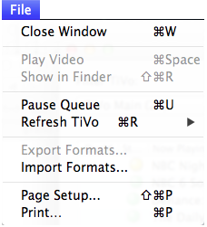
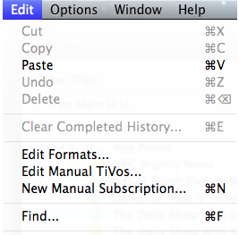

#Overview
## An overview of cTiVo operation and controls

In this document, we describe the following parts of cTiVo operation:
- [Normal Use](#normal-use)
- [Controls and Buttons](#controls-and-buttons)
- [Clicking Away](#clicking-away)
- [Menu Items](#menu-items)

## Normal use

First you need to give cTiVo permission to talk to your TiVos; see our [Installation](Installation.md) instructions.

When you start cTiVo, you'll see three tables. The top table lists all the shows available on your TiVo. The middle table lists the shows being transferred to your Mac (called the download queue). The bottom table will list any series that you are "subscribed" to: cTiVo will automatically download any new shows of these series as soon as they are recorded.

To use, just drag one or more shows from the top table to either the download or subscription lists. 

Shows will start downloading immediately; although as the shows are quite large, it can take 30-50 minutes per hour of programs downloaded. You will see a progress bar ticking away as it goes through its download/encoding stages. Note that you don't have to leave the window open; you can close it entirely, and cTiVo will keep running in the background. Just use the menu item Window>Main Window to restore the window.

## Controls and Buttons

- **!TiVo Name/Filter TiVo**: In the upper left corner is the name of your TiVo, or if you have more than one, a list of them. The default is to display all shows from all TiVos, but if you wish to see only one at a time, you can select it here. This control shows the number of shows available on this TiVo.
- **Video Format**: which lets you choose which video format you'd like cTiVo to use to save the download show. Unfortunately, video files are quite large and complicated, and many different formats for video files have evolved over the years. Notably, the resolution (number of pixels) can vary dramatically from one use to another. More information available here in [Formats](AdvancedTopics#Edit_Formats).
- **Find**: If you hit Cmd-F (or menu item Edit>Find...), then a "Find" box will appear in the middle of the top bar to let you quickly display a subset of the TiVo show list.
- **Download Folder**: lets you can choose where the shows will be stored after being downloaded.
- **Subscribe** and **Download** (or **Add to Queue**) buttons: do the same as dragging the shows to the respective table. Just select one or more shows and click the button.
- **Remove from Queue** and **Unsubscribe** buttons: remove downloads or subscriptions from their respective tables. You can also use Cmd-Delete to do the same, or just drag to the trash.

## Clicking away

- Double-clicking on a show in the Now Playing list at the top will open a drawer giving you more information about that show.
- Double-clicking on a completed download will launch that video in your default video player (normally [QuickTime Player](http://www.apple.com/quicktime/)).
- Note that you can drag/drop shows within the Downloads table to change their order, or restart a failed download.
- Right-clicking on any show or download will give you context-sensitive commands for that show (such as Download, Delete, Subscribe, Show in Finder, Play Video)
- Clicking on any column header will sort that table by that column.
- Right-clicking on any column header will let you configure which information is available. You can also drag the dividers to control width of any column.
- Hovering over any control will give you a tool-tip with more information on that item. Hovering over any field that is too narrow to read will give you the rest of that text.

## Menu Items

- **File>Play Video** (available when a downloaded show is selected) launches your system's video player, usually QuickTime Player to watch the show.
- **File>Show in Finder** (available when a downloaded show is selected) will select that show in the Finder for you.
- **File>Pause/Resume Queue** will pause or resume further processing of the queue. A big red "Paused" will appear when the queue is not running to warn you that nothing is currently happening. If any show is active, you will have the choice of finishing the current job, or stopping it immediately for later restart. You'll get the same choice upon Quitting as well.
- **File>Refresh TiVo** lets you immediately reload the show list from the TiVo to see if there's any new ones. (Otherwise, it's on a 15-minute refresh rate). If you have more than one, you can refresh all or just one.
- **File>Import/Export Formats** lets you create a small text file describing your custom format. This can be used to share formats with others.

- **Edit>Clear Completed History** (Cmd-E) will remove the records for all completed downloads from your download table, successful or not.
- **Edit>Edit Formats** is for advanced users who wish to use new encoders or tune the parameters for encoders. You can also show/hide any of the factory-provided formats.
- **Edit>Edit Manual TiVos** lets you add/edit TiVos manually. Normally, cTiVo discovers TiVos on the local network automatically using a network technology called [Bonjour](http://www.apple.com/support/bonjour/). If you need to enter a TiVo address manually or wish to access TiVo's remotely, you'll need to enter their information here.
- **Edit>New Manual Subscription** (Cmd-N) lets you create a subscription by just typing the show's name. Note that it will record any show whose name contains the text you provide here. For example, House would match House, House Hunting, and Warehouse 13. (Regular subscriptions created from an existing show have to match the entire name.) In particular, you can type ALL here to download every show your TiVo subscribes to. See [Advanced Topics](Advanced-Topics.md) for more information.
- **Edit>Find** shows/hides a Find box that lets you search the list of shows for a particular text.
## Drawer contents

If you double-click on a show, cTiVo will open a drawer on the side of the main table with more information that TiVo has about that show. It will only display information relevant to that show; in particular, it displays different information for movies vs TV shows. You can close the drawer with the close button on its top.